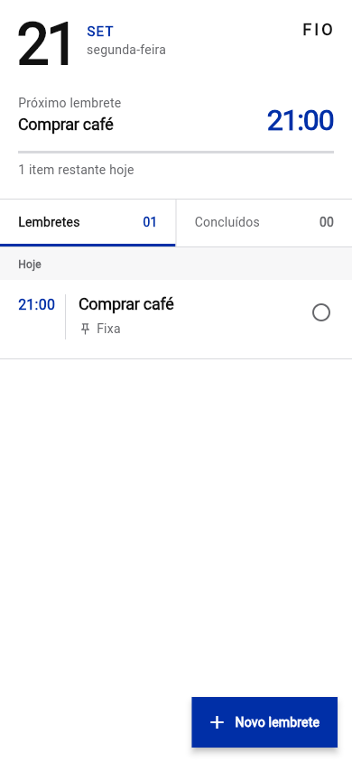
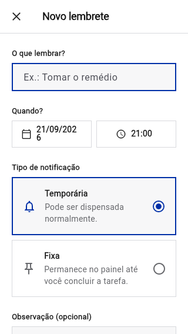
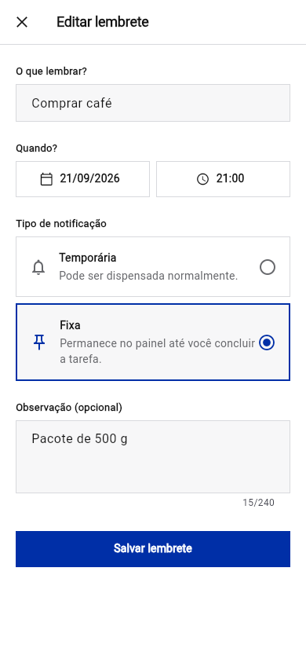
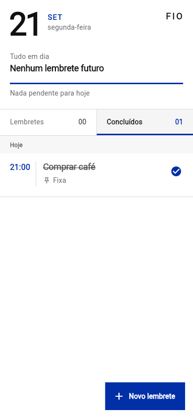

# Relatório de QA e revisão de código: Fio

| Campo | Valor |
|---|---|
| Data | 21/09/2026 |
| Alvo visual | Harness temporário Flutter Web em `http://127.0.0.1:7357` |
| Sessão | `fio-qa-01f7dd238d75` |
| Viewports | 390×844 e 320×568 |
| Escopo | Tela inicial, criação, edição, conclusão, estados vazios, responsividade e acessibilidade |

## Resumo do frontend

| Severidade | Quantidade |
|---|---:|
| Crítica | 0 |
| Alta | 1 |
| Média | 2 |
| Baixa | 1 |
| **Total** | **4** |

O fluxo principal funcionou: validação do título, criação, edição, conclusão, troca de abas e calendário. Não foram observadas exceções no console. A auditoria axe-core não reportou violações, mas sua cobertura sobre a árvore semântica renderizada pelo Flutter Web é limitada; a inspeção direta da árvore expôs os problemas abaixo.

## Problemas do frontend

### ISSUE-001: exclusão só está disponível por gesto de arrastar

| Campo | Valor |
|---|---|
| Severidade | alta |
| Categoria | acessibilidade / UX |
| Tela | Lista de lembretes |
| Vídeo | N/A — problema estático de disponibilidade do controle |

**Descrição**

Não existe botão, menu ou ação semântica de exclusão. A árvore acessível do item expõe apenas o grupo do lembrete e “Marcar como concluído”. Usuários de teclado, leitor de tela ou que não descobrirem o gesto horizontal não conseguem excluir um lembrete.

**Reprodução**

1. Crie um lembrete e volte à tela inicial.
2. Observe que o item oferece apenas o controle de conclusão; a exclusão só aparece após arrastar o item para a esquerda.

### ISSUE-002: data quebra em duas linhas em largura de 320 px

| Campo | Valor |
|---|---|
| Severidade | média |
| Categoria | visual / responsividade |
| Tela | Novo lembrete |
| Vídeo | N/A — problema visível no carregamento |

**Descrição**

No viewport 320×568, o texto `21/09/2026` não cabe na metade da linha reservada ao seletor e quebra antes do último dígito. O valor deixa de parecer uma data única.

**Reprodução**

1. Use uma largura de 320 px.
2. Abra “Novo lembrete”.
3. Observe o valor do seletor de data em duas linhas.

### ISSUE-003: opções de notificação não informam qual está selecionada

| Campo | Valor |
|---|---|
| Severidade | média |
| Categoria | acessibilidade |
| Tela | Novo/Editar lembrete |
| Vídeo | N/A — problema na semântica do controle |

**Descrição**

“Temporária” e “Fixa” são expostas como botões comuns. Mesmo quando “Fixa” está visualmente marcada, a árvore acessível não contém estado `selected`, `checked` ou papel de rádio. Um leitor de tela anuncia os textos, mas não identifica a escolha atual.

**Reprodução**

1. Abra um lembrete e selecione “Fixa”.
2. Inspecione a árvore acessível: as duas opções continuam descritas apenas como `button`.

### ISSUE-004: indicador de progresso não possui nome acessível

| Campo | Valor |
|---|---|
| Severidade | baixa |
| Categoria | acessibilidade |
| Tela | Tela inicial |
| Vídeo | N/A — problema estático de semântica |

**Descrição**

O indicador é anunciado somente como `progressbar "0"` ou `progressbar "100"`, sem informar que representa a conclusão dos lembretes do dia. O texto próximo ajuda visualmente, mas não nomeia semanticamente o componente.

## Revisão do código

### CR-001 — alta: falha ao agendar pode deixar lembrete salvo sem notificação

Em `ReminderController.add`, o item é persistido antes de `schedule`. Se o plugin lançar uma exceção, o lembrete permanece armazenado, `notifyListeners` não é chamado e o formulário continua em “Salvando…”. O mesmo padrão aparece em `update`, após cancelar a notificação antiga. Como notificar é a função central do app, persistência e agendamento precisam de tratamento explícito de erro/compensação e feedback ao usuário.

Locais: `lib/features/reminders/presentation/reminder_controller.dart:67` e `:79`.

### CR-002 — média: tarefas atrasadas fazem o cabeçalho afirmar “Tudo em dia”

`nextReminder` ignora qualquer lembrete passado e `remainingToday` exige `date.isAfter(now)`. Assim, um item de hoje que acabou de atrasar continua visível como pendente, mas o cabeçalho muda para “Tudo em dia” e “Nada pendente para hoje”. O progresso também deixa de contar esse item no denominador.

Locais: `lib/features/reminders/presentation/reminder_controller.dart:32` e `:97`.

### CR-003 — média: edição após reiniciar perde o uso de alarme exato

`_canScheduleExactAlarms` começa como `false` e só é atualizado por `requestPermission`, chamado durante `add`. O fluxo `update` agenda diretamente. Depois de abrir o app novamente e editar um lembrete, ele será reagendado no modo aproximado mesmo que o usuário já tenha concedido alarmes exatos; permissões de notificação revogadas também não geram feedback nesse fluxo.

Locais: `lib/features/reminders/services/local_notification_service.dart:14` e `lib/features/reminders/presentation/reminder_controller.dart:73`.

### CR-004 — média: fallback silencioso para UTC pode alterar o horário do lembrete

Qualquer erro ao resolver o fuso local é capturado de forma ampla e substituído por UTC. Em fusos como `America/Sao_Paulo`, isso pode deslocar a notificação em três horas sem avisar o usuário. É melhor normalizar aliases conhecidos e, se ainda falhar, registrar/mostrar erro em vez de alterar silenciosamente a referência temporal.

Local: `lib/features/reminders/services/local_notification_service.dart:19`.

### CR-005 — média: armazenamento corrompido ou de versão antiga pode impedir a inicialização

O repositório trata apenas `FormatException`. JSON válido com campo ausente, tipo diferente ou enum desconhecido lança `TypeError`, `StateError` ou erro de parse fora desse bloco. Uma migração futura também ficaria frágil. O carregamento deve validar cada registro, ignorar/registrar itens inválidos e preservar os demais.

Local: `lib/features/reminders/data/local_reminder_repository.dart:17`.

### CR-006 — baixa: ícone de notificação usa o launcher icon

O serviço usa `@mipmap/ic_launcher`. A própria documentação instalada do `flutter_local_notifications` recomenda um recurso `drawable` monocromático para notificações e alerta que recursos precisam ser preservados na build release. Em alguns aparelhos o ícone pode aparecer como um quadrado ou silhueta inadequada.

Local: `lib/features/reminders/services/local_notification_service.dart:26`.

## Verificações aprovadas

- `flutter analyze`: nenhum problema.
- `flutter test`: 4 testes aprovados.
- Browser: criação, edição, conclusão, abas, estado vazio e calendário funcionaram.
- Console do navegador: nenhuma exceção; apenas a mensagem normal de inicialização.
- Layout de 390×844: sem sobreposições ou cortes observados.
- Seletor de data em 320×568: renderização correta.

## Lacunas de teste recomendadas

- falha/negação do serviço de notificações;
- lembrete atrasado e cálculo do cabeçalho/progresso;
- edição após reinicialização do serviço;
- JSON parcialmente inválido e migração de schema;
- viewport de 320 px e escala de fonte ampliada;
- ações acessíveis de selecionar tipo e excluir.
